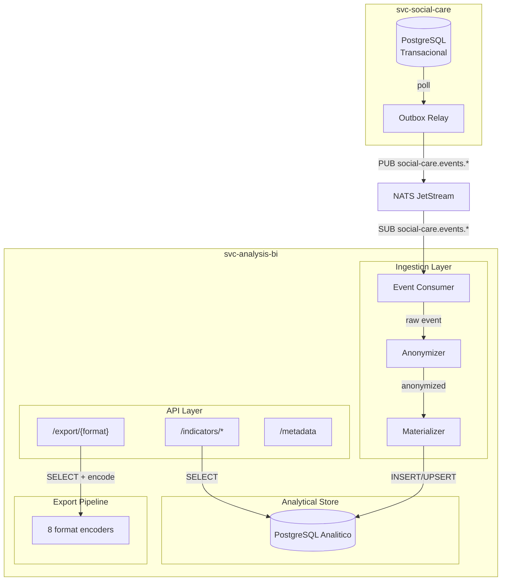

# ADR-001: Service Design — svc-analysis-bi

**Status:** Accepted
**Date:** 2026-04-11
**Author:** Architecture Team, ACDG Brasil

---

## 1. Context

A ACDG Brasil (Associacao Brasileira de Profissionais Atuantes em Doencas Geneticas) e uma organizacao sem fins lucrativos que desenvolve tecnologia para cuidado e defesa de pacientes com doencas geneticas raras. O servico `svc-social-care` (Swift/Vapor, PostgreSQL, CQRS + Event Sourcing + Transactional Outbox) ja esta em operacao e gerencia prontuarios sociais de pacientes.

O proximo servico planejado e o `svc-analysis-bi`: um servico de analise descritiva que consome eventos de dominio emitidos pelo `svc-social-care` e disponibiliza indicadores anonimizados para advocacy, pesquisa academica e elaboracao de politicas publicas. Os dados devem ser exportaveis em multiplos formatos, incluindo FHIR Bundle conforme o padrao BR Core (profiles RNDS).

### Publico-alvo dos dados

- **Advocacy (ONGs):** indicadores agregados para embasar politicas publicas de protecao a pacientes com doencas geneticas raras.
- **Medicos pesquisadores:** dados epidemiologicos e demograficos para estudos populacionais e elaboracao de diretrizes clinicas.
- **Estudantes academicos:** datasets anonimizados para pesquisas em saude publica, servico social e areas correlatas.

### Requisitos nao-funcionais

- Anonimizacao rigorosa: nenhum dado pessoal identificavel (PII) deve existir no banco analitico.
- Conformidade com K-anonimidade K=5 em todos os outputs publicados.
- Historico temporal de indicadores (serie temporal), nao apenas snapshots.
- Granularidade geografica limitada a mesorregiao/microrregiao IBGE para impedir reidentificacao.
- Export em 8 formatos distintos para compatibilidade com SUS (DBF/DBC), pesquisa (CSV/Parquet), interoperabilidade (FHIR) e uso geral (JSON/XML/ODS).
- Escala: arquitetura pensada para crescimento horizontal desde o inicio.

---

## 2. Decision

### 2.1 Stack

**Go** e a linguagem escolhida.

| Criterio | Avaliacao |
|---|---|
| Criacao de dados binarios | Controle fino sobre bytes, encoding e formatos binarios (Parquet, DBF, DBC) sem overhead de runtime |
| Pipelines concorrentes | Goroutines e channels sao primitivas nativas para pipelines de ingestao, transformacao e export paralelos |
| Footprint operacional | Binario estatico, ~10MB de imagem Docker, startup em milissegundos |
| Ecossistema | Bibliotecas maduras para NATS (nats.go), PostgreSQL (pgx), Parquet (parquet-go), DBF (go-dbf) |

**Bibliotecas:**

| Componente | Biblioteca |
|---|---|
| HTTP router | chi |
| NATS client | nats.go |
| PostgreSQL | pgx v5 |
| Parquet | parquet-go (segmentio) |
| DBF | go-dbf |
| DBC | CGo com blast-dbf ou encoding LZ77 custom |
| FHIR | Structs manuais (BR Core profiles) |
| CSV/JSON/XML | stdlib |
| ODS | excelize |

### 2.2 Posicionamento: API-only

O servico segue o prefixo `svc-*` da organizacao: nao possui UI. A interface visual sera um `app-*` separado (futuro).

### 2.3 Fonte de dados: eventos via NATS

O `svc-social-care` publica domain events via Transactional Outbox + NATS. O relay publica em subjects com o padrao `social-care.events.<EventType>`, capturados pelo JetStream stream `SOCIAL_CARE_EVENTS`. O `svc-analysis-bi` consome via JetStream consumer com durable name para garantia at-least-once.

### 2.4 Banco: PostgreSQL analitico separado

Instancia PostgreSQL dedicada, fisicamente isolada do banco do `svc-social-care`. O isolamento de carga impede que queries analiticas pesadas afetem a latencia do sistema transacional. O schema segue modelagem dimensional (star schema).

### 2.5 K-anonimidade K=5

Todo output publicado pela API garante que qualquer combinacao de quasi-identificadores (faixa etaria, sexo, mesorregiao) contenha no minimo 5 registros. Grupos com menos de 5 sao suprimidos.

### 2.6 Serie temporal

Indicadores sao armazenados com historico temporal. Cada snapshot mensal e persistido como um registro na fact table, permitindo analise de tendencias e comparacoes intertemporais.

### 2.7 Granularidade geografica: IBGE

Enderecos exatos sao generalizados para mesorregiao/microrregiao IBGE no momento da ingestao. O mapeamento CEP-para-mesorregiao usa a tabela de correspondencia do IBGE.

### 2.8 Formatos de export

| Formato | Publico | Motivacao |
|---|---|---|
| CSV | Universal | Formato mais acessivel |
| JSON | Desenvolvedores | Integracao programatica |
| XML | Sistemas legados | Compatibilidade governamental |
| Parquet | Data science | Colunar otimizado para analytics |
| DBF | DataSUS | Formato historico do SUS (TABWIN) |
| DBC | DataSUS | DBF comprimido com LZ77 (DataSUS nativo) |
| ODS | Pesquisadores | Planilha aberta (LibreOffice) |
| FHIR Bundle | Interoperabilidade | HL7 FHIR R4 com profiles BR Core (RNDS) |

### 2.9 FHIR: BR Core desde o inicio

Na v1, o servico e read-only: gera FHIR Bundles para export. A integracao bidirecional com RNDS sera implementada quando a ACDG obtiver credenciamento.

Recursos FHIR utilizados:
- `Patient` (anonimizado: faixa etaria, sexo, mesorregiao)
- `Observation` (indicadores de saude, condicoes de moradia)
- `Condition` (diagnosticos CID)
- `Encounter` (atendimentos sociais)
- `Bundle` (type=collection para export)

### 2.10 Escopo v1: 100% interno

Sem credenciais externas. Publicacao em OpenDataSUS, RNDS e dados.gov.br e escopo futuro.

---

## 3. Architecture

### 3.1 Diagrama de componentes



### 3.2 Fluxo de dados

```
svc-social-care (PostgreSQL transacional)
    |  Transactional Outbox
    v
NATS JetStream (stream SOCIAL_CARE_EVENTS)
    |  SUB via durable consumer (at-least-once)
    v
Event Consumer -> Anonymizer -> Materializer -> PostgreSQL Analitico
    |                                                    |
    | 1. Deserializa JSON                                | SELECT
    | 2. Valida schema                                   v
    | 3. Extrai campos                            API Layer / Export Pipeline
    v
Suppression: descarta PII (CPF, nome, actorId)
Generalization: idade->faixa, CEP->mesorregiao
K-anonymity: marca grupos < K=5 para supressao no output
```

---

## 4. Data Model

### 4.1 Dimension tables

```sql
CREATE TABLE dim_geography (
    id              SERIAL PRIMARY KEY,
    mesoregion_code VARCHAR(4) NOT NULL,
    mesoregion_name VARCHAR(100) NOT NULL,
    microregion_code VARCHAR(5),
    microregion_name VARCHAR(100),
    state_code      VARCHAR(2) NOT NULL,
    region          VARCHAR(20) NOT NULL,
    UNIQUE(mesoregion_code, microregion_code)
);

CREATE TABLE dim_age_band (
    id         SERIAL PRIMARY KEY,
    band_label VARCHAR(10) NOT NULL UNIQUE,
    min_age    INT NOT NULL,
    max_age    INT
);

CREATE TABLE dim_diagnosis (
    id        SERIAL PRIMARY KEY,
    icd_code  VARCHAR(10) NOT NULL UNIQUE,
    icd_label VARCHAR(255) NOT NULL,
    chapter   VARCHAR(5),
    block     VARCHAR(10)
);

CREATE TABLE dim_sex (
    id    SERIAL PRIMARY KEY,
    label VARCHAR(20) NOT NULL UNIQUE
);

CREATE TABLE dim_housing_type (
    id    SERIAL PRIMARY KEY,
    label VARCHAR(30) NOT NULL UNIQUE
);

CREATE TABLE dim_education_level (
    id    SERIAL PRIMARY KEY,
    label VARCHAR(50) NOT NULL UNIQUE
);

CREATE TABLE dim_benefit_type (
    id    SERIAL PRIMARY KEY,
    label VARCHAR(100) NOT NULL UNIQUE
);

CREATE TABLE dim_period (
    id         SERIAL PRIMARY KEY,
    year       INT NOT NULL,
    month      INT NOT NULL,
    year_month VARCHAR(7) NOT NULL UNIQUE,
    quarter    INT NOT NULL
);

CREATE TABLE dim_referral_destination (
    id    SERIAL PRIMARY KEY,
    label VARCHAR(100) NOT NULL UNIQUE
);

CREATE TABLE dim_violation_type (
    id    SERIAL PRIMARY KEY,
    label VARCHAR(100) NOT NULL UNIQUE
);
```

### 4.2 Fact tables

```sql
CREATE TABLE fact_patient_snapshot (
    id                      BIGSERIAL PRIMARY KEY,
    period_id               INT NOT NULL REFERENCES dim_period(id),
    age_band_id             INT NOT NULL REFERENCES dim_age_band(id),
    sex_id                  INT NOT NULL REFERENCES dim_sex(id),
    geography_id            INT NOT NULL REFERENCES dim_geography(id),
    housing_type_id         INT REFERENCES dim_housing_type(id),
    education_level_id      INT REFERENCES dim_education_level(id),
    income_band             VARCHAR(20),
    receives_benefit        BOOLEAN,
    has_deficiency          BOOLEAN,
    food_insecurity         BOOLEAN,
    is_overcrowded          BOOLEAN,
    family_size             INT,
    assessment_completeness DECIMAL(3,2),
    patient_hash            VARCHAR(64) NOT NULL,
    UNIQUE(period_id, patient_hash)
);

CREATE TABLE fact_diagnosis (
    id              BIGSERIAL PRIMARY KEY,
    period_id       INT NOT NULL REFERENCES dim_period(id),
    diagnosis_id    INT NOT NULL REFERENCES dim_diagnosis(id),
    geography_id    INT NOT NULL REFERENCES dim_geography(id),
    age_band_id     INT NOT NULL REFERENCES dim_age_band(id),
    sex_id          INT NOT NULL REFERENCES dim_sex(id),
    new_cases       INT NOT NULL DEFAULT 0,
    total_cases     INT NOT NULL DEFAULT 0
);

CREATE TABLE fact_appointment (
    id               BIGSERIAL PRIMARY KEY,
    period_id        INT NOT NULL REFERENCES dim_period(id),
    geography_id     INT NOT NULL REFERENCES dim_geography(id),
    appointment_type VARCHAR(50),
    count            INT NOT NULL DEFAULT 1
);

CREATE TABLE fact_referral (
    id              BIGSERIAL PRIMARY KEY,
    period_id       INT NOT NULL REFERENCES dim_period(id),
    geography_id    INT NOT NULL REFERENCES dim_geography(id),
    destination_id  INT NOT NULL REFERENCES dim_referral_destination(id),
    count           INT NOT NULL DEFAULT 1
);

CREATE TABLE fact_violation (
    id                BIGSERIAL PRIMARY KEY,
    period_id         INT NOT NULL REFERENCES dim_period(id),
    geography_id      INT NOT NULL REFERENCES dim_geography(id),
    violation_type_id INT NOT NULL REFERENCES dim_violation_type(id),
    count             INT NOT NULL DEFAULT 1
);

CREATE TABLE fact_benefit (
    id                BIGSERIAL PRIMARY KEY,
    period_id         INT NOT NULL REFERENCES dim_period(id),
    geography_id      INT NOT NULL REFERENCES dim_geography(id),
    benefit_type_id   INT NOT NULL REFERENCES dim_benefit_type(id),
    beneficiary_count INT NOT NULL DEFAULT 0,
    total_amount      DECIMAL(12,2)
);

CREATE TABLE fact_family_composition (
    id                       BIGSERIAL PRIMARY KEY,
    period_id                INT NOT NULL REFERENCES dim_period(id),
    geography_id             INT NOT NULL REFERENCES dim_geography(id),
    avg_family_size          DECIMAL(4,1),
    total_families           INT NOT NULL DEFAULT 0,
    families_with_elderly    INT NOT NULL DEFAULT 0,
    families_with_children   INT NOT NULL DEFAULT 0
);
```

### 4.3 Tabelas de controle

```sql
CREATE TABLE event_processing_log (
    event_id     UUID PRIMARY KEY,
    event_type   VARCHAR(100) NOT NULL,
    processed_at TIMESTAMPTZ NOT NULL DEFAULT NOW(),
    status       VARCHAR(20) NOT NULL DEFAULT 'processed'
);

CREATE TABLE event_dlq (
    id          BIGSERIAL PRIMARY KEY,
    event_id    UUID NOT NULL,
    event_type  VARCHAR(100) NOT NULL,
    payload     JSONB NOT NULL,
    error       TEXT NOT NULL,
    received_at TIMESTAMPTZ NOT NULL DEFAULT NOW(),
    retried_at  TIMESTAMPTZ,
    retry_count INT NOT NULL DEFAULT 0
);
```

---

## 5. Domain Events Consumed

| Evento | Subject NATS | Eixo |
|---|---|---|
| PatientCreatedEvent | social-care.events.PatientCreatedEvent | Demografico |
| FamilyMemberAddedEvent | social-care.events.FamilyMemberAddedEvent | Demografico |
| FamilyMemberRemovedEvent | social-care.events.FamilyMemberRemovedEvent | Demografico |
| PrimaryCaregiverAssignedEvent | social-care.events.PrimaryCaregiverAssignedEvent | Cuidado |
| SocialIdentityUpdatedEvent | social-care.events.SocialIdentityUpdatedEvent | Demografico |
| HousingConditionUpdatedEvent | social-care.events.HousingConditionUpdatedEvent | Socioeconomico |
| SocioEconomicSituationUpdatedEvent | social-care.events.SocioEconomicSituationUpdatedEvent | Socioeconomico |
| WorkAndIncomeUpdatedEvent | social-care.events.WorkAndIncomeUpdatedEvent | Socioeconomico |
| EducationalStatusUpdatedEvent | social-care.events.EducationalStatusUpdatedEvent | Socioeconomico |
| HealthStatusUpdatedEvent | social-care.events.HealthStatusUpdatedEvent | Epidemiologico |
| CommunitySupportNetworkUpdatedEvent | social-care.events.CommunitySupportNetworkUpdatedEvent | Protecao |
| SocialHealthSummaryUpdatedEvent | social-care.events.SocialHealthSummaryUpdatedEvent | Cuidado |
| PlacementHistoryUpdatedEvent | social-care.events.PlacementHistoryUpdatedEvent | Protecao |
| IntakeInfoUpdatedEvent | social-care.events.IntakeInfoUpdatedEvent | Cuidado |
| SocialCareAppointmentRegisteredEvent | social-care.events.SocialCareAppointmentRegisteredEvent | Cuidado |
| ReferralCreatedEvent | social-care.events.ReferralCreatedEvent | Protecao |
| RightsViolationReportedEvent | social-care.events.RightsViolationReportedEvent | Protecao |

Nota: eventos de assessment carregam diff `before/after`. O Anonymizer consome apenas o campo `after`.

---

## 6. API Surface

### 6.1 Indicadores

```
GET /api/v1/indicators/demographics
    ?period_start=2025-01&period_end=2026-03&mesoregion=3106&granularity=monthly

GET /api/v1/indicators/epidemiological
    ?period_start=2025-01&period_end=2026-03&top=20&granularity=monthly

GET /api/v1/indicators/socioeconomic
    ?period_start=2025-01&period_end=2026-03&mesoregion=3106&granularity=monthly

GET /api/v1/indicators/protection
    ?period_start=2025-01&period_end=2026-03&granularity=monthly

GET /api/v1/indicators/care
    ?period_start=2025-01&period_end=2026-03&granularity=monthly
```

### 6.2 Export

```
GET /api/v1/export/{format}
    ?dataset=full|demographics|epidemiological|socioeconomic|protection|care
    &period_start=2025-01&period_end=2026-03&mesoregion=3106

    format: csv | json | xml | parquet | dbf | dbc | ods | fhir

    Content-Disposition: attachment; filename="acdg-{dataset}-{period}.{ext}"
```

### 6.3 Metadata

```
GET /api/v1/metadata/datasets
GET /api/v1/metadata/formats
GET /api/v1/metadata/regions
```

### 6.4 Health

```
GET /health       -> liveness
GET /ready        -> readiness (NATS + PostgreSQL)
```

### 6.5 Resposta padrao

```json
{
  "data": [],
  "meta": {
    "timestamp": "2026-04-11T14:30:00Z",
    "period": "2026-03",
    "k_threshold": 5,
    "suppressed_groups": 3,
    "total_records": 1247
  }
}
```

---

## 7. Anonymization Flow

### 7.1 Pipeline

```
Evento NATS (contem PII)
    |
    v
[1] SUPPRESSION
    - patientId -> SHA-256 hash (dedup only)
    - actorId, memberId, victimId, caregiverId, professionalId -> descartados
    - CPF, NIS, CNS, nome -> nunca presentes nos eventos
    |
    v
[2] GENERALIZATION
    - birthDate -> faixa etaria 5 anos (dim_age_band)
    - CEP -> mesorregiao IBGE (dim_geography)
    - totalFamilyIncome -> faixa de renda (0-0.5SM, 0.5-1SM, 1-2SM, 2-3SM, 3-5SM, 5+SM)
    |
    v
[3] K-ANONYMITY CHECK
    - Verificar grupo (faixa_etaria, sexo, mesorregiao) >= K-1
    - Se nao: persistir mas marcar below_k_threshold
    |
    v
[4] API OUTPUT FILTER
    - Queries excluem grupos com count < K
    - meta.suppressed_groups informa quantos omitidos
```

### 7.2 Campos que NUNCA existem no banco analitico

| Campo | Tratamento |
|---|---|
| CPF, NIS, CNS, nome, endereco | Nunca presentes nos domain events |
| patientId (UUID) | SHA-256 hash one-way com salt |
| actorId, memberId, victimId | Descartados integralmente |
| caregiverId, professionalId | Descartados integralmente |

### 7.3 Salt para hash

SHA-256 do patientId usa salt estatico por ambiente (env var `PATIENT_HASH_SALT`). Serve exclusivamente para deduplicacao. Nao e reversivel nem exposto na API.

---

## 8. Time Series Strategy

### 8.1 Grain: mensal

Indicadores computados com granularidade mensal via `dim_period`.

### 8.2 Snapshot mensal

`fact_patient_snapshot` contem um registro por paciente (hash) por mes. Eventos fazem UPSERT no periodo atual. Meses anteriores sao imutaveis.

### 8.3 Fechamento de periodo

Job periodico no primeiro dia de cada mes:
1. Carry-forward: copia pacientes ativos para o novo periodo
2. Marca periodo anterior como fechado
3. `REFRESH MATERIALIZED VIEW CONCURRENTLY`

### 8.4 Retencao

Dados retidos indefinidamente na v1. Politica de retencao sera avaliada quando o volume justificar.

---

## 9. Indicator Axes

### 9.1 Demografico

| Indicador | Fonte | Formula |
|---|---|---|
| Piramide etaria | SocialIdentityUpdatedEvent | COUNT por (faixa_etaria, sexo, mesorregiao) |
| Distribuicao por sexo | SocialIdentityUpdatedEvent | COUNT por sexo |
| Distribuicao geografica | SocialIdentityUpdatedEvent | COUNT por mesorregiao |
| Tipo de moradia | HousingConditionUpdatedEvent | COUNT por housing_type |

### 9.2 Epidemiologico

| Indicador | Fonte | Formula |
|---|---|---|
| Distribuicao por CID | HealthStatusUpdatedEvent | COUNT por icd_code |
| Top N diagnosticos | HealthStatusUpdatedEvent | RANK por total_cases DESC |
| Novos casos/mes | HealthStatusUpdatedEvent | COUNT novos por periodo |

### 9.3 Socioeconomico

| Indicador | Fonte | Formula |
|---|---|---|
| Faixas de renda | SocioEconomicSituationUpdatedEvent | COUNT por income_band |
| Beneficios sociais | SocioEconomicSituationUpdatedEvent | COUNT e SUM por benefit_type |
| Densidade habitacional | HousingConditionUpdatedEvent | AVG(moradores/quartos) |
| Vulnerabilidade educacional | EducationalStatusUpdatedEvent | COUNT por tipo |

### 9.4 Protecao

| Indicador | Fonte | Formula |
|---|---|---|
| Encaminhamentos/mes | ReferralCreatedEvent | COUNT por periodo e destination |
| Violacoes de direitos | RightsViolationReportedEvent | COUNT por periodo e tipo |
| Acolhimento | PlacementHistoryUpdatedEvent | COUNT por tipo |

### 9.5 Cuidado

| Indicador | Fonte | Formula |
|---|---|---|
| Atendimentos/mes | AppointmentRegisteredEvent | COUNT por periodo e type |
| Cobertura assessments | Todos os *UpdatedEvent | % com cada assessment |
| Completude prontuario | SocialHealthSummaryUpdatedEvent | AVG(completeness) |

---

## 10. Project Structure

```
svc-analysis-bi/
├── cmd/server/main.go
├── internal/
│   ├── domain/
│   │   ├── indicator.go
│   │   ├── anonymizer.go
│   │   ├── k_anonymity.go
│   │   └── geography.go
│   ├── ingestion/
│   │   ├── consumer.go
│   │   ├── handler.go
│   │   ├── anonymize.go
│   │   ├── materialize.go
│   │   └── events/
│   ├── store/
│   │   ├── postgres.go
│   │   ├── dimensions.go
│   │   ├── facts.go
│   │   ├── indicators.go
│   │   └── migrations/
│   ├── api/
│   │   ├── router.go
│   │   ├── middleware/
│   │   ├── handlers/
│   │   └── response.go
│   └── export/
│       ├── encoder.go
│       ├── csv.go
│       ├── json.go
│       ├── xml.go
│       ├── parquet.go
│       ├── dbf.go
│       ├── dbc.go
│       ├── ods.go
│       └── fhir/
│           ├── bundle.go
│           ├── patient.go
│           ├── observation.go
│           ├── condition.go
│           └── encounter.go
├── configs/
│   ├── config.go
│   └── ibge_mesoregions.csv
├── migrations/
├── go.mod
├── Dockerfile
├── Makefile
└── handbook/
```

---

## 11. Consequences

### Positive

1. **Isolamento de carga completo.** Banco analitico nao impacta social-care.
2. **PII nunca armazenado.** Anonimizacao na ingestao elimina riscos de vazamento.
3. **Desacoplamento temporal.** NATS com durable consumer tolera downtime.
4. **Multi-formato de export.** Compatibilidade com DataSUS, pesquisa, FHIR.
5. **FHIR-ready.** Integracao RNDS futura sem redesenho.
6. **Serie temporal nativa.** Tendencias e comparacoes como cidadas de primeira classe.
7. **K-anonimidade com transparencia.** `suppressed_groups` no meta.

### Negative

1. **Eventual consistency.** Indicadores com atraso (polling 1s + processamento).
2. **Complexidade DBC.** CGo ou encoding manual LZ77.
3. **8 encoders para manter.** Custo de testes e validacao.
4. **Schema drift.** Structs Go duplicam structs Swift; requer coordenacao via contracts.
5. **Hash do patientId.** Vetor teorico de correlacao se salt vazar.
6. **Sem UI na v1.** Dependencia de ferramentas externas para visualizacao.

---

## 12. FHIR Mapping

| Recurso FHIR | Profile BR Core | Dados mapeados |
|---|---|---|
| Patient | BRCorePatient | Faixa etaria (extension), sexo, mesorregiao |
| Observation | BRCoreObservation | Indicadores socioeconomicos, moradia |
| Condition | BRCoreCondition | Diagnosticos CID-10 |
| Encounter | BRCoreEncounter | Atendimentos sociais |
| Bundle | -- | type=collection |

Anonimizacao FHIR:
- `Patient.identifier`: ausente
- `Patient.name`: ausente
- `Patient.address`: apenas state + extensao mesorregiao
- `Patient.birthDate`: extensao `age-band`
- `Reference(Patient)`: hash anonimizado

---

## 13. References

- FHIR BR Core (RNDS) profiles: simplifier.net/redenacionaldedadosemsaude
- IBGE: Divisao Regional em Mesorregioes e Microrregioes
- K-anonymity: Sweeney, L. (2002)
- NATS JetStream: docs.nats.io/nats-concepts/jetstream
- Plano de Dados Abertos MS 2024-2026
- 5 Estrelas dos Dados Abertos: 5stardata.info/pt-BR
